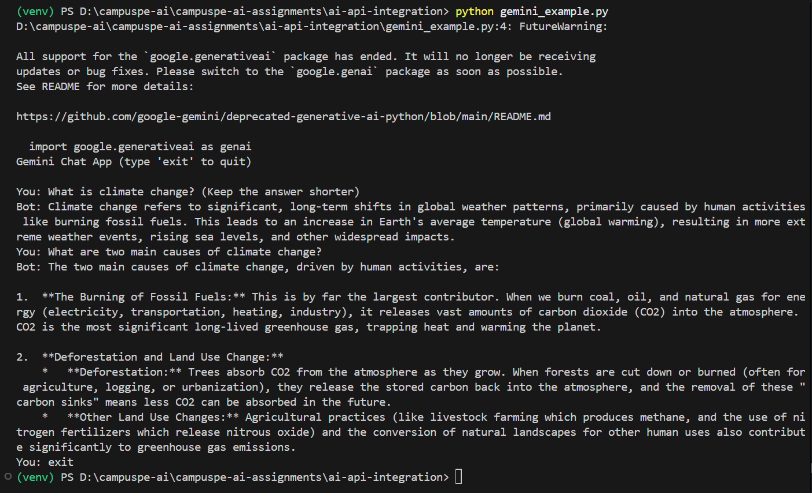
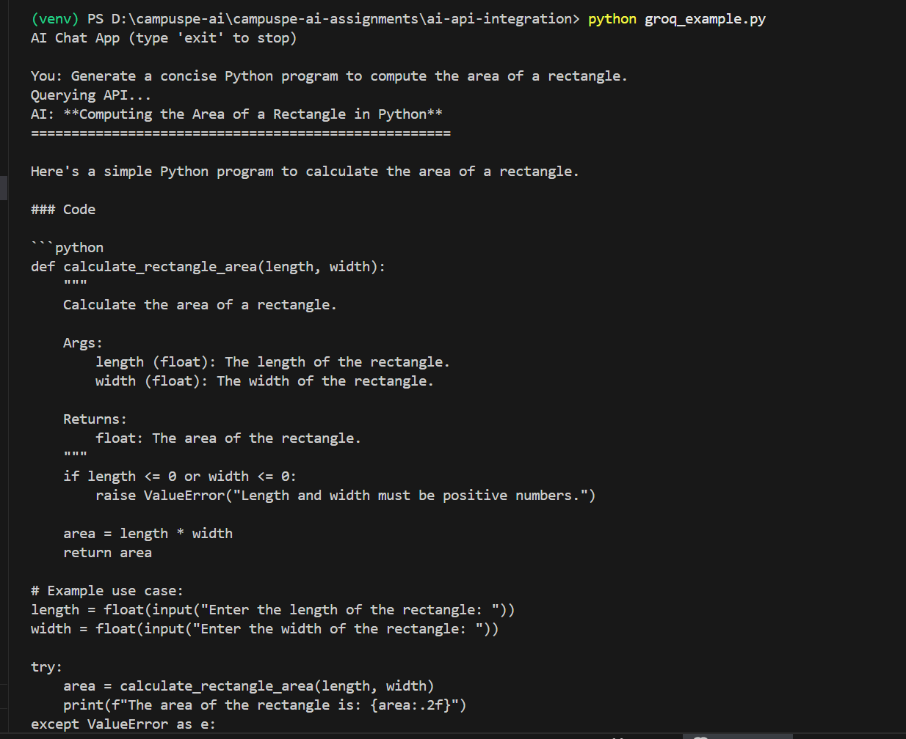
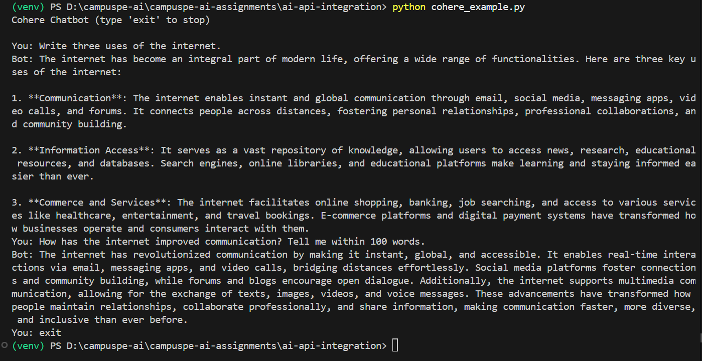
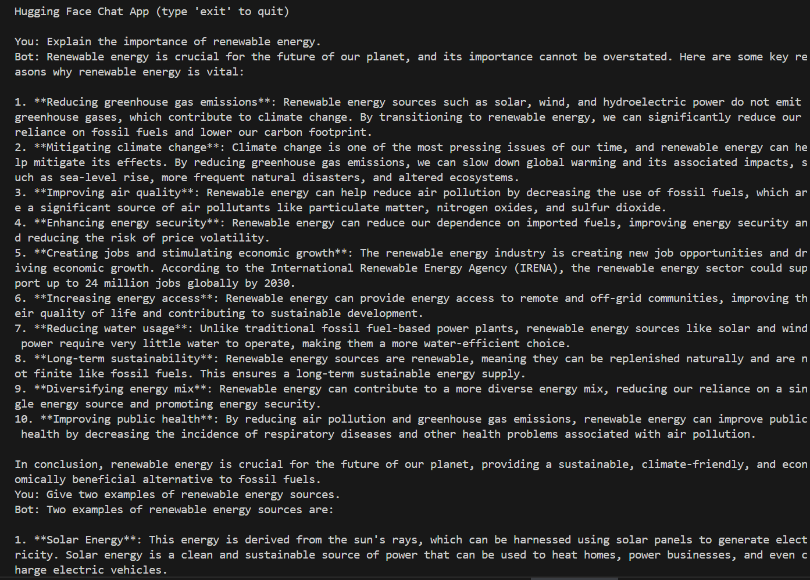
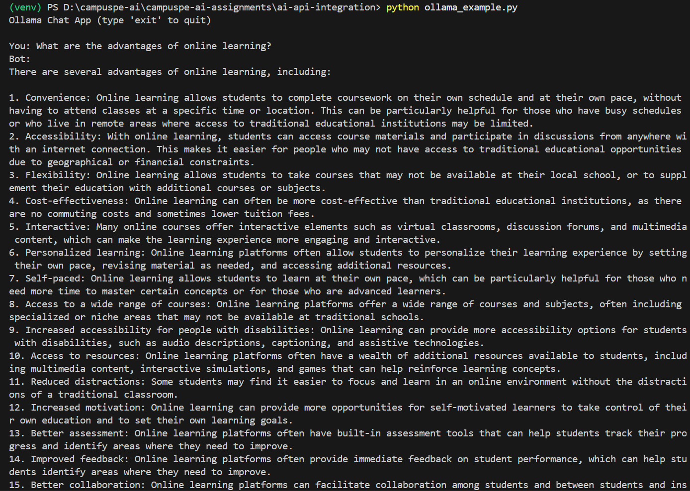

# AI API Integration using Python

## Project Description

This project demonstrates how to integrate multiple Artificial Intelligence APIs using Python.
Each program connects to a different AI provider and allows users to send prompts and receive AI-generated responses.

The project includes the following programs:

* `gemini_example.py` – Uses Google Gemini API
* `groq_example.py` – Uses Groq API
* `cohere_example.py` – Uses Cohere API
* `huggingface_example.py` – Uses Hugging Face API
* `ollama_example.py` – Uses Ollama local model
* `multi_api_query.py` – Unified program to interact with all providers

---

# Setup Instructions

## 1. Create Virtual Environment

```bash
python -m venv venv
```

Activate the environment:

Windows

```bash
venv\Scripts\activate
```

---

## 2. Install Required Libraries

```bash
pip install requests
pip install google-generativeai
pip install cohere
pip install groq
```

---

# How to Obtain Each API Key

## Gemini API Key

1. Visit https://aistudio.google.com
2. Sign in with Google account
3. Click **Get API Key**

Set the environment variable:

```powershell
setx GEMINI_API_KEY "your_gemini_api_key"
```

---

## Groq API Key

1. Visit https://console.groq.com
2. Create an account and generate API key

Set the environment variable:

```powershell
setx GROQ_API_KEY "your_groq_api_key"
```

---

## Cohere API Key

1. Visit https://dashboard.cohere.com
2. Create an account and generate API key

Set the environment variable:

```powershell
setx COHERE_API_KEY "your_cohere_api_key"
```

---

## Hugging Face API Key

1. Visit https://huggingface.co
2. Login and go to **Settings → Access Tokens**
3. Generate a token

Set the environment variable:

```powershell
setx HF_TOKEN "your_huggingface_token"
```

---

## Ollama Setup

Download Ollama from:

https://ollama.com

Start Ollama server:

```bash
ollama serve
```

Install model:

```bash
ollama pull llama2
```

---

# How to Run Each Program

Navigate to the project folder and activate the virtual environment.

---

## Run Gemini Program

```bash
python gemini_example.py
```

---

## Run Groq Program

```bash
python groq_example.py
```

---

## Run Cohere Program

```bash
python cohere_example.py
```

---

## Run Hugging Face Program

```bash
python huggingface_example.py
```

---

## Run Ollama Program

```bash
python ollama_example.py
```

---

## Run Unified Multi-API Program

```bash
python multi_api_query.py
```

This program allows the user to choose between:

1. Gemini
2. Cohere
3. Groq
4. Hugging Face
5. Ollama

After selecting a provider, the user enters a prompt and receives the AI response.

---

# Screenshots of Working Programs

## Screenshots

### Gemini Program


### Groq Program


### Cohere Program


### Hugging Face Program


### Ollama Program


### Multi API Program


---

# Technologies Used

* Python
* REST APIs
* Google Gemini API
* Groq API
* Cohere API
* Hugging Face Inference API
* Ollama Local LLM
